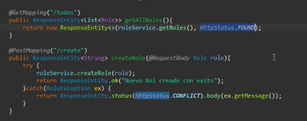

# Prueba de inserción de datos

Creación de datos para una tabla `Persona` usando 3 métodos distintos

- JDBC (No probado)
- JPA Hibernate (Funciona)
- MyBatis (Funciona)

Cada método de creación se encuentra en su respectiva **branch**

## THE REST UPDATE (Valido para **jpaBranch**)

Revisar las implicancias y casos de uso de la clase `ResponseEntity` para manejar todo lo pertinente a respuestas Http y aplicación de métodos de servicio.

